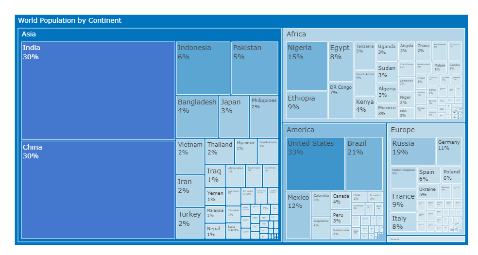

Isn't it amazing to see how much population this earth covers?
Thanks to Google, we all know it!
But yet, It's mesmerizing to see the population of each country, each continent.

In this little project, I try to find out this!
And guess what Asia covered almost 60% of the population on this planet. 

